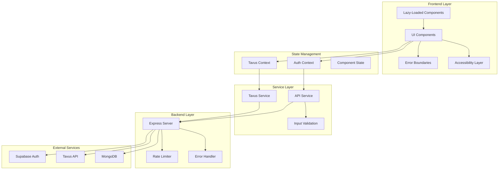

# Design Document: Codebase Improvements

## Overview

This design addresses eight critical improvement areas for the Neurix.ai mental wellness platform: UI/UX readability, error handling, performance optimization, code quality, accessibility compliance, testing infrastructure, security hardening, and documentation. The improvements will be implemented incrementally to maintain system stability while enhancing user experience and code maintainability.

The platform currently uses React 18 with TypeScript, Vite for bundling, Supabase for authentication, Tavus API for AI video sessions, and MongoDB for data storage. The improvements will leverage existing infrastructure while introducing modern best practices for web application development.

## Architecture

### High-Level Architecture



### Component Organization

The design introduces a layered architecture with clear separation of concerns:

1. **Presentation Layer**: UI components with accessibility enhancements and contrast-compliant styling
2. **Error Handling Layer**: Hierarchical error boundaries with user-friendly fallbacks
3. **Performance Layer**: Code-split routes and lazy-loaded components
4. **Service Layer**: Centralized API calls with validation and error handling
5. **Security Layer**: Input validation, rate limiting, and secure API key management

## Components and Interfaces

### 1. UI/UX Readability Components

#### ContrastChecker Utility

```typescript
interface ContrastRatio {
  ratio: number;
  passes: {
    aa: boolean;
    aaa: boolean;
    aaLarge: boolean;
    aaaLarge: boolean;
  };
}

interface ColorPair {
  foreground: string;
  background: string;
}

class ContrastChecker {
  /**
   * Calculate contrast ratio between two colors
   * @param foreground - Foreground color (hex, rgb, or rgba)
   * @param background - Background color (hex, rgb, or rgba)
   * @returns Contrast ratio and WCAG compliance status
   */
  static calculateContrast(foreground: string, background: string): ContrastRatio;
  
  /**
   * Get accessible color from brand palette
   * @param background - Background color
   * @param isLargeText - Whether text is large (18pt+ or 14pt+ bold)
   * @returns Accessible foreground color from brand palette
   */
  static getAccessibleColor(background: string, isLargeText: boolean): string;
  
  /**
   * Validate all text elements on a page meet WCAG AA
   * @returns Array of elements failing contrast requirements
   */
  static auditPage(): HTMLElement[];
}
```

#### Theme Configuration

```typescript
interface BrandColors {
  primary: '#0033FF';
  deepBlue: '#0600AB';
  darkNavy: '#00033D';
  purple: '#977DFF';
  white: '#FFFFFF';
  // Derived colors with guaranteed contrast
  textOnPrimary: string;
  textOnDeepBlue: string;
  textOnDarkNavy: string;
  textOnPurple: string;
}

interface ThemeConfig {
  colors: BrandColors;
  contrastRatios: {
    normalText: 4.5;
    largeText: 3.0;
  };
}
```

### 2. Error Handling Components

#### Enhanced Error Boundary

```typescript
interface ErrorBoundaryProps {
  children: ReactNode;
  fallback?: ReactNode;
  onError?: (error: Error, errorInfo: ErrorInfo) => void;
  level: 'app' | 'page' | 'widget';
}

interface ErrorBoundaryState {
  hasError: boolean;
  error: Error | null;
  errorInfo: ErrorInfo | null;
}

class EnhancedErrorBoundary extends Component<ErrorBoundaryProps, ErrorBoundaryState> {
  // Catches errors in child components
  static getDerivedStateFromError(error: Error): ErrorBoundaryState;
  
  // Logs errors and calls onError callback
  componentDidCatch(error: Error, errorInfo: ErrorInfo): void;
  
  // Renders fallback UI based on error level
  render(): ReactNode;
}
```

#### Error Service

```typescript
interface ErrorContext {
  component?: string;
  action?: string;
  userId?: string;
  timestamp: Date;
}

interface UserFriendlyError {
  title: string;
  message: string;
  actions: ErrorAction[];
}

interface ErrorAction {
  label: string;
  handler: () => void;
  variant: 'primary' | 'secondary';
}

class ErrorService {
  /**
   * Convert technical error to user-friendly message
   * @param error - Original error object
   * @param context - Additional context about where error occurred
   * @returns User-friendly error with suggested actions
   */
  static toUserFriendlyError(error: Error, context: ErrorContext): UserFriendlyError;
  
  /**
   * Log error for debugging while showing simplified message to user
   * @param error - Error object
   * @param context - Error context
   */
  static logError(error: Error, context: ErrorContext): void;
  
  /**
   * Determine if error is recoverable
   * @param error - Error object
   * @returns Whether user can retry the operation
   */
  static isRecoverable(error: Error): boolean;
}
```

### 3. Performance Optimization Components

#### Route Configuration with Code Splitting

```typescript
interface RouteConfig {
  path: string;
  component: LazyExoticComponent<ComponentType<any>>;
  preload?: () => Promise<void>;
  protected: boolean;
}

const routes: RouteConfig[] = [
  {
    path: '/dashboard',
    component: lazy(() => import('./pages/Dashboard')),
    preload: () => import('./pages/Dashboard'),
    protected: true
  },
  {
    path: '/session',
    component: lazy(() => import('./pages/Session')),
    preload: () => import('./pages/Session'),
    protected: true
  },
  // ... other routes
];
```

#### Performance Monitoring

```typescript
interface PerformanceMetrics {
  componentName: string;
  renderTime: number;
  mountTime: number;
  updateCount: number;
}

class PerformanceMonitor {
  /**
   * Track component render performance
   * @param componentName - Name of component being measured
   * @param callback - Function to measure
   */
  static measureRender(componentName: string, callback: () => void): PerformanceMetrics;
  
  /**
   * Identify components that should be memoized
   * @returns List of components with excessive re-renders
   */
  static identifyMemoizationCandidates(): string[];
}
```

### 4. Code Quality Components

#### Shared Hooks

```typescript
/**
 * Custom hook for form handling with validation
 */
interface UseFormOptions<T> {
  initialValues: T;
  validate: (values: T) => Record<keyof T, string>;
  onSubmit: (values: T) => Promise<void>;
}

function useForm<T>(options: UseFormOptions<T>): {
  values: T;
  errors: Record<keyof T, string>;
  handleChange: (field: keyof T, value: any) => void;
  handleSubmit: (e: FormEvent) => Promise<void>;
  isSubmitting: boolean;
};

/**
 * Custom hook for API calls with loading and error states
 */
interface UseApiOptions<T> {
  endpoint: string;
  method: 'GET' | 'POST' | 'PUT' | 'DELETE';
  body?: any;
  onSuccess?: (data: T) => void;
  onError?: (error: Error) => void;
}

function useApi<T>(options: UseApiOptions<T>): {
  data: T | null;
  loading: boolean;
  error: Error | null;
  execute: () => Promise<void>;
  reset: () => void;
};
```

#### Type Definitions

```typescript
// User types
interface User {
  id: string;
  email: string;
  fullName: string | null;
  avatarUrl: string | null;
  createdAt: Date;
  updatedAt: Date;
}

// Session types
interface SessionConfig {
  duration: number;
  replicaId: string;
  conversationId: string;
}

interface SessionState {
  status: 'idle' | 'connecting' | 'active' | 'ended' | 'error';
  startTime: Date | null;
  endTime: Date | null;
  error: Error | null;
}

// API response types
interface ApiResponse<T> {
  data: T | null;
  error: ApiError | null;
  meta: {
    timestamp: Date;
    requestId: string;
  };
}

interface ApiError {
  code: string;
  message: string;
  details?: Record<string, any>;
}
```

### 5. Accessibility Components

#### AccessibilityProvider

```typescript
interface AccessibilityConfig {
  announcePageChanges: boolean;
  trapFocusInModals: boolean;
  enableKeyboardShortcuts: boolean;
}

interface AccessibilityContext {
  config: AccessibilityConfig;
  announce: (message: string, priority: 'polite' | 'assertive') => void;
  trapFocus: (element: HTMLElement) => () => void;
  restoreFocus: (element: HTMLElement) => void;
}

const AccessibilityProvider: FC<{
  children: ReactNode;
  config?: Partial<AccessibilityConfig>;
}>;

const useAccessibility: () => AccessibilityContext;
```

#### FocusTrap Component

```typescript
interface FocusTrapProps {
  children: ReactNode;
  active: boolean;
  onEscape?: () => void;
  initialFocus?: RefObject<HTMLElement>;
  returnFocus?: RefObject<HTMLElement>;
}

const FocusTrap: FC<FocusTrapProps>;
```

### 6. Testing Infrastructure

#### Test Utilities

```typescript
/**
 * Render component with all necessary providers
 */
interface RenderOptions {
  initialRoute?: string;
  user?: User;
  theme?: ThemeConfig;
}

function renderWithProviders(
  component: ReactElement,
  options?: RenderOptions
): RenderResult;

/**
 * Create mock user for testing
 */
function createMockUser(overrides?: Partial<User>): User;

/**
 * Create mock API response
 */
function createMockApiResponse<T>(
  data: T,
  overrides?: Partial<ApiResponse<T>>
): ApiResponse<T>;
```

#### Property-Based Testing Setup

```typescript
import fc from 'fast-check';

/**
 * Arbitrary generators for domain objects
 */
const arbitraries = {
  user: fc.record({
    id: fc.uuid(),
    email: fc.emailAddress(),
    fullName: fc.option(fc.fullName()),
    avatarUrl: fc.option(fc.webUrl()),
    createdAt: fc.date(),
    updatedAt: fc.date()
  }),
  
  sessionConfig: fc.record({
    duration: fc.integer({ min: 300, max: 3600 }),
    replicaId: fc.uuid(),
    conversationId: fc.uuid()
  }),
  
  colorHex: fc.hexaString({ minLength: 6, maxLength: 6 }).map(s => `#${s}`)
};

/**
 * Property test configuration
 */
const propertyTestConfig = {
  numRuns: 100,
  verbose: true,
  seed: Date.now()
};
```

### 7. Security Components

#### Input Validation Service

```typescript
interface ValidationRule {
  type: 'required' | 'email' | 'minLength' | 'maxLength' | 'pattern' | 'custom';
  value?: any;
  message: string;
  validator?: (value: any) => boolean;
}

interface ValidationSchema {
  [field: string]: ValidationRule[];
}

class InputValidator {
  /**
   * Validate input against schema
   * @param data - Input data to validate
   * @param schema - Validation schema
   * @returns Validation errors or null if valid
   */
  static validate(
    data: Record<string, any>,
    schema: ValidationSchema
  ): Record<string, string> | null;
  
  /**
   * Sanitize HTML input to prevent XSS
   * @param input - User input string
   * @returns Sanitized string
   */
  static sanitizeHtml(input: string): string;
  
  /**
   * Validate and sanitize form data
   * @param formData - Form data object
   * @param schema - Validation schema
   * @returns Validated and sanitized data or validation errors
   */
  static validateForm(
    formData: Record<string, any>,
    schema: ValidationSchema
  ): { data: Record<string, any> } | { errors: Record<string, string> };
}
```

#### Rate Limiter (Server-side)

```typescript
interface RateLimitConfig {
  windowMs: number;
  maxRequests: number;
  message: string;
  skipSuccessfulRequests?: boolean;
}

interface RateLimitStore {
  increment: (key: string) => Promise<number>;
  decrement: (key: string) => Promise<void>;
  resetKey: (key: string) => Promise<void>;
}

class RateLimiter {
  constructor(config: RateLimitConfig, store?: RateLimitStore);
  
  /**
   * Express middleware for rate limiting
   */
  middleware(): RequestHandler;
  
  /**
   * Check if request should be rate limited
   * @param identifier - Unique identifier (IP, user ID, etc.)
   * @returns Whether request is allowed
   */
  checkLimit(identifier: string): Promise<boolean>;
}
```

### 8. Documentation Components

#### JSDoc Templates

```typescript
/**
 * Component description
 * 
 * @component
 * @example
 * ```tsx
 * <ComponentName prop1="value" prop2={123} />
 * ```
 * 
 * @param {Object} props - Component props
 * @param {string} props.prop1 - Description of prop1
 * @param {number} props.prop2 - Description of prop2
 * @param {Function} [props.onAction] - Optional callback
 * 
 * @returns {JSX.Element} Rendered component
 */
```

## Data Models

### Enhanced User Profile

```typescript
interface UserProfile extends User {
  preferences: {
    theme: 'light' | 'dark' | 'auto';
    language: string;
    notifications: boolean;
    accessibility: {
      highContrast: boolean;
      reducedMotion: boolean;
      screenReader: boolean;
    };
  };
  sessions: {
    total: number;
    lastSession: Date | null;
  };
}
```

### Error Log Entry

```typescript
interface ErrorLogEntry {
  id: string;
  timestamp: Date;
  level: 'error' | 'warning' | 'info';
  message: string;
  stack: string;
  context: ErrorContext;
  user: {
    id: string;
    email: string;
  } | null;
  resolved: boolean;
  resolvedAt: Date | null;
}
```

### Performance Metric

```typescript
interface PerformanceMetric {
  id: string;
  timestamp: Date;
  metricType: 'render' | 'api' | 'navigation';
  componentName: string;
  duration: number;
  metadata: Record<string, any>;
}
```

## Correctness Properties

*A property is a characteristic or behavior that should hold true across all valid executions of a system—essentially, a formal statement about what the system should do. Properties serve as the bridge between human-readable specifications and machine-verifiable correctness guarantees.*


### Property Reflection

After analyzing all acceptance criteria, I've identified the following consolidations to eliminate redundancy:

**UI/UX Properties (1.1-1.5):**
- Properties 1.1 and 1.3 both test contrast ratios - can be combined into a single comprehensive property
- Property 1.5 is a specific case of property 1.1 (white-on-white is a contrast failure)
- Keep: 1.1 (comprehensive contrast), 1.2 (glassmorphism), 1.4 (fallback colors)

**Error Handling Properties (2.1-2.5):**
- All properties test different aspects of error handling and are not redundant
- Keep all: 2.1 (API errors), 2.2 (graceful degradation), 2.3 (error classification), 2.4 (dual logging), 2.5 (state preservation)

**Performance Properties (3.1-3.5):**
- Properties 3.1 and 3.5 both test code splitting/lazy loading - can be combined
- Keep: 3.1 (code splitting), 3.2 (lazy loading), 3.3 (memoization)

**Code Quality Properties (4.1-4.5):**
- Most are structural checks (examples) rather than runtime properties
- Keep: 4.3 (auth consistency)

**Accessibility Properties (5.1-5.5):**
- All properties test different accessibility aspects and are not redundant
- Keep all: 5.1 (ARIA labels), 5.2 (keyboard navigation), 5.3 (focus management), 5.4 (form accessibility), 5.5 (redundant encoding)

**Security Properties (7.1-7.5):**
- All properties test different security aspects and are not redundant
- Keep all: 7.1 (API key security), 7.2 (rate limiting), 7.3 (input validation), 7.5 (XSS prevention)

### Correctness Properties

#### Property 1: Text Contrast Compliance
*For any* text element rendered on any page, the contrast ratio between text and background SHALL be at least 4.5:1 for normal text (under 18pt or 14pt bold) and at least 3:1 for large text (18pt+ or 14pt+ bold).

**Validates: Requirements 1.1, 1.3, 1.5**

#### Property 2: Glassmorphism Readability
*For any* UI component with glassmorphism effects (blur, transparency), adjusting the background opacity or text color SHALL maintain a minimum contrast ratio of 4.5:1 for normal text.

**Validates: Requirements 1.2**

#### Property 3: Contrast Fallback Selection
*For any* color combination that fails WCAG AA contrast requirements, the system SHALL select an alternative color from the brand palette (#0033FF, #0600AB, #00033D, #977DFF, #FFFFFF) that meets the minimum contrast ratio.

**Validates: Requirements 1.4**

#### Property 4: User-Friendly Error Messages
*For any* Tavus API error, the error handler SHALL produce a user-friendly message containing: (1) a clear explanation of what went wrong, (2) at least one suggested next step, and (3) no technical jargon or stack traces.

**Validates: Requirements 2.1**

#### Property 5: Graceful Degradation
*For any* session creation failure, the system SHALL provide at least two alternative actions (e.g., "Try Again", "Contact Support", "Use Chat Instead") to the user.

**Validates: Requirements 2.2**

#### Property 6: Error Classification
*For any* network error, the error handler SHALL correctly classify it as either client-side (4xx status codes, network unavailable) or server-side (5xx status codes) and display appropriate messaging for each category.

**Validates: Requirements 2.3**

#### Property 7: Dual Error Handling
*For any* error caught by an error boundary, the system SHALL both (1) log detailed error information including stack trace and context, and (2) display a simplified user-friendly message without technical details.

**Validates: Requirements 2.4**

#### Property 8: Error Recovery State Preservation
*For any* failed operation that supports retry, retrying the operation SHALL preserve the user's context including form data, navigation state, and scroll position.

**Validates: Requirements 2.5**

#### Property 9: Route Code Splitting
*For any* route navigation, the system SHALL load only the code bundle for the target route, not the entire application bundle, as verified by network request inspection.

**Validates: Requirements 3.1, 3.5**

#### Property 10: Component Lazy Loading
*For any* heavy component (>50KB), the component SHALL not be loaded until it is actually rendered in the DOM, as verified by network request timing.

**Validates: Requirements 3.2**

#### Property 11: Memoization Effectiveness
*For any* memoized function or component, re-rendering with identical dependencies SHALL not trigger re-execution of the memoized computation.

**Validates: Requirements 3.3**

#### Property 12: Authentication Single Source of Truth
*For any* authentication state query, the system SHALL return the same value whether queried from AuthContext, Supabase client, or any component, with no localStorage fallbacks.

**Validates: Requirements 4.3**

#### Property 13: Interactive Element Accessibility
*For any* interactive element (button, link, input, custom control), the element SHALL have either an aria-label attribute, aria-labelledby reference, or visible text content for screen readers.

**Validates: Requirements 5.1**

#### Property 14: Keyboard Navigation
*For any* page, navigating through all interactive elements using only the Tab key SHALL (1) provide visible focus indicators, (2) follow a logical reading order, and (3) reach all interactive elements.

**Validates: Requirements 5.2**

#### Property 15: Modal Focus Management
*For any* modal or dialog, opening the modal SHALL trap focus within it, and closing the modal SHALL return focus to the element that triggered it.

**Validates: Requirements 5.3**

#### Property 16: Form Accessibility
*For any* form, each input SHALL have an associated label (via htmlFor or aria-labelledby), and validation errors SHALL be announced to screen readers via aria-live regions.

**Validates: Requirements 5.4**

#### Property 17: Redundant Information Encoding
*For any* information conveyed through color alone (e.g., status indicators, alerts), the same information SHALL also be conveyed through text, icons, or patterns.

**Validates: Requirements 5.5**

#### Property 18: API Key Security
*For any* API key used in the application, sensitive keys (Tavus API key, MongoDB credentials) SHALL only exist in server-side environment variables, not in client-side code or VITE_ prefixed variables.

**Validates: Requirements 7.1**

#### Property 19: Rate Limiting Enforcement
*For any* API endpoint, making more than the configured maximum number of requests within the time window SHALL result in a 429 (Too Many Requests) response.

**Validates: Requirements 7.2**

#### Property 20: Input Validation
*For any* user input, the system SHALL validate the input against a schema before processing, and invalid input SHALL be rejected with a descriptive error message.

**Validates: Requirements 7.3**

#### Property 21: XSS Prevention
*For any* user-generated content, rendering the content SHALL sanitize HTML tags and JavaScript to prevent XSS attacks, while preserving safe formatting like line breaks.

**Validates: Requirements 7.5**

## Error Handling

### Error Hierarchy

The system implements a three-level error boundary hierarchy:

1. **App-Level Boundary**: Catches catastrophic errors that prevent the entire app from functioning
   - Displays full-page error message with reload option
   - Logs error to monitoring service
   - Provides contact support option

2. **Page-Level Boundary**: Catches errors within specific pages
   - Displays error message within page layout
   - Maintains navigation functionality
   - Offers navigation to other pages

3. **Widget-Level Boundary**: Catches errors in non-critical widgets (chat, emergency)
   - Fails silently without blocking main app
   - Shows small error indicator
   - Provides retry option

### Error Recovery Strategies

```typescript
interface RecoveryStrategy {
  type: 'retry' | 'fallback' | 'redirect' | 'ignore';
  maxRetries?: number;
  fallbackComponent?: ComponentType;
  redirectPath?: string;
}

const errorRecoveryStrategies: Record<string, RecoveryStrategy> = {
  'TavusAPIError': {
    type: 'fallback',
    fallbackComponent: ChatFallback,
  },
  'NetworkError': {
    type: 'retry',
    maxRetries: 3,
  },
  'AuthenticationError': {
    type: 'redirect',
    redirectPath: '/auth',
  },
  'WidgetError': {
    type: 'ignore',
  },
};
```

### User-Friendly Error Messages

Error messages follow this template:
- **Title**: Short, clear description (e.g., "Connection Lost")
- **Message**: Explanation in plain language (e.g., "We couldn't connect to the server. This might be a temporary issue.")
- **Actions**: 1-3 actionable buttons (e.g., "Try Again", "Go to Dashboard", "Contact Support")

## Testing Strategy

### Dual Testing Approach

The testing strategy combines unit tests and property-based tests for comprehensive coverage:

**Unit Tests** (using Vitest):
- Specific examples demonstrating correct behavior
- Edge cases (empty inputs, boundary values, null/undefined)
- Error conditions (invalid inputs, API failures)
- Integration points between components
- Mock external dependencies (Supabase, Tavus API)

**Property-Based Tests** (using fast-check):
- Universal properties that hold for all inputs
- Minimum 100 iterations per property test
- Generate random valid and invalid inputs
- Test invariants and relationships
- Each property test references its design document property

### Test Configuration

```typescript
// vitest.config.ts
export default defineConfig({
  test: {
    globals: true,
    environment: 'jsdom',
    setupFiles: './src/test/setup.ts',
    coverage: {
      provider: 'v8',
      reporter: ['text', 'json', 'html'],
      exclude: [
        'node_modules/',
        'src/test/',
        '**/*.d.ts',
        '**/*.config.*',
        '**/mockData',
      ],
      thresholds: {
        lines: 70,
        functions: 70,
        branches: 70,
        statements: 70,
      },
    },
  },
});
```

### Property Test Example

```typescript
import fc from 'fast-check';

describe('Feature: codebase-improvements, Property 1: Text Contrast Compliance', () => {
  it('should ensure all text meets minimum contrast ratios', () => {
    fc.assert(
      fc.property(
        fc.record({
          text: fc.string({ minLength: 1 }),
          foreground: arbitraries.colorHex,
          background: arbitraries.colorHex,
          fontSize: fc.integer({ min: 12, max: 72 }),
          fontWeight: fc.constantFrom('normal', 'bold'),
        }),
        (config) => {
          const isLargeText = 
            (config.fontSize >= 18) || 
            (config.fontSize >= 14 && config.fontWeight === 'bold');
          
          const minRatio = isLargeText ? 3.0 : 4.5;
          const ratio = ContrastChecker.calculateContrast(
            config.foreground,
            config.background
          );
          
          // If contrast is insufficient, system should use fallback color
          if (ratio.ratio < minRatio) {
            const fallbackColor = ContrastChecker.getAccessibleColor(
              config.background,
              isLargeText
            );
            const fallbackRatio = ContrastChecker.calculateContrast(
              fallbackColor,
              config.background
            );
            expect(fallbackRatio.ratio).toBeGreaterThanOrEqual(minRatio);
          }
        }
      ),
      { numRuns: 100 }
    );
  });
});
```

### Test Organization

```
src/
├── components/
│   ├── Button.tsx
│   ├── Button.test.tsx          # Unit tests
│   └── Button.property.test.tsx # Property tests
├── services/
│   ├── errorService.ts
│   ├── errorService.test.ts
│   └── errorService.property.test.ts
└── test/
    ├── setup.ts                 # Test setup
    ├── utils.tsx                # Test utilities
    └── arbitraries.ts           # Property test generators
```

### Testing Priorities

1. **Critical Path Testing** (Highest Priority):
   - Authentication flows (sign in, sign up, sign out)
   - Session creation and management
   - Error handling and recovery
   - Accessibility features

2. **Property-Based Testing** (High Priority):
   - Contrast ratio calculations
   - Input validation
   - Error message generation
   - State preservation during retries

3. **Integration Testing** (Medium Priority):
   - API service integration
   - Context provider interactions
   - Route navigation and code splitting

4. **E2E Testing** (Medium Priority):
   - Complete user journeys (sign up → book session → complete session)
   - Error recovery flows
   - Accessibility with assistive technologies

## Implementation Notes

### Phase 1: Critical Fixes (Week 1-2)
- Fix UI/UX contrast issues across all pages
- Enhance error boundaries with user-friendly messages
- Move sensitive API keys to server-side

### Phase 2: Performance & Quality (Week 3-4)
- Implement code splitting for all routes
- Refactor large components (Dashboard.tsx)
- Add TypeScript types for all functions

### Phase 3: Accessibility & Testing (Week 5-6)
- Add ARIA labels to all interactive elements
- Implement focus management for modals
- Set up Vitest and fast-check
- Write property tests for critical properties

### Phase 4: Security & Documentation (Week 7-8)
- Implement input validation across all forms
- Add rate limiting to API endpoints
- Write JSDoc comments for complex functions
- Create architecture diagrams
- Write CONTRIBUTING.md

### Migration Strategy

To minimize disruption:
1. Create new components alongside existing ones
2. Gradually migrate pages to use new components
3. Run both old and new implementations in parallel during testing
4. Switch to new implementation once validated
5. Remove old implementation after successful migration

### Monitoring and Validation

Post-implementation validation:
- Run automated accessibility audits (axe-core, Lighthouse)
- Monitor error rates and user feedback
- Track performance metrics (bundle size, load time)
- Review test coverage reports
- Conduct manual testing with screen readers
