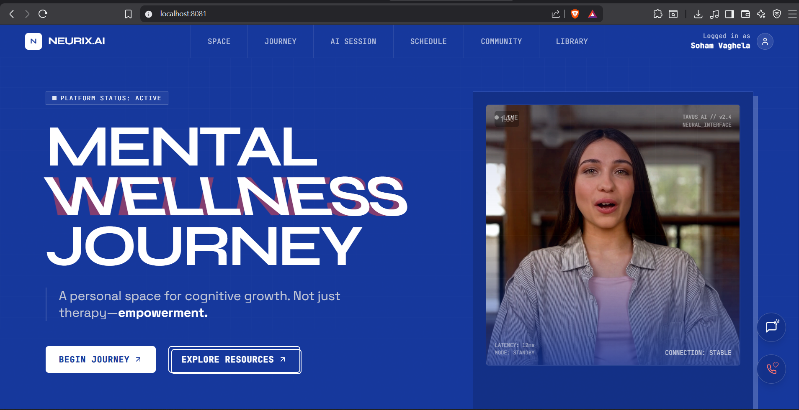
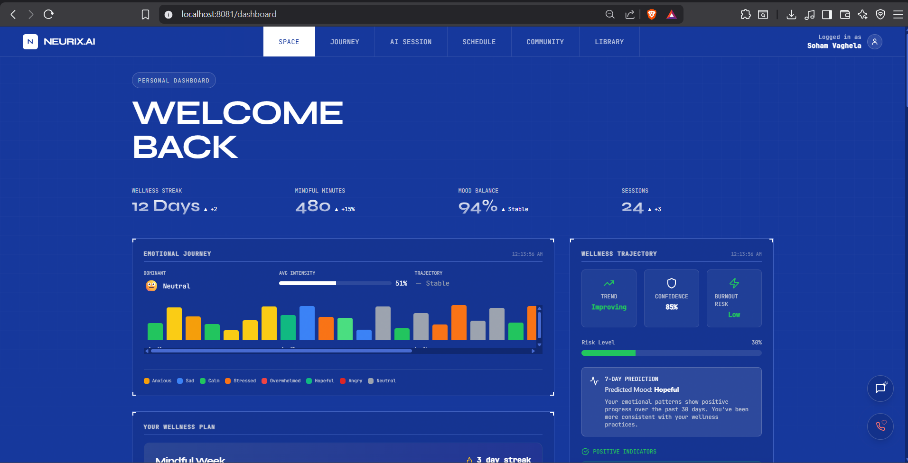
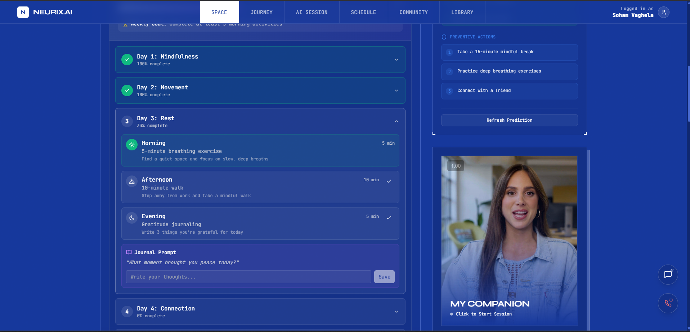
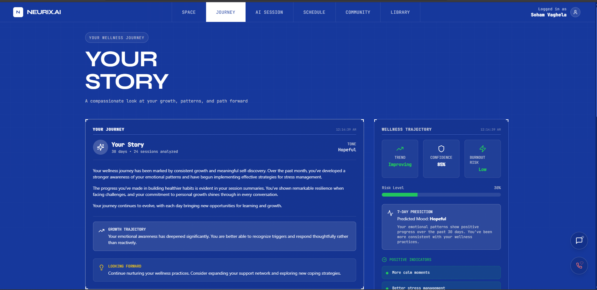

<div align="center">

# 🧠 NEURIX.AI

### *Your AI-Powered Mental Wellness Companion*


[](https://reactjs.org/)
[](https://www.typescriptlang.org/)
[](https://nodejs.org/)
[](https://www.mongodb.com/)
[](https://supabase.com/)
[](https://tailwindcss.com/)
[](https://ai.google.dev/)
[](LICENSE)

**An AI-powered mental wellness platform featuring real-time video conversations with AI companions, personalized wellness plans, cognitive insights, and community support.**

[🚀 Live Demo](#) • [📖 Documentation](#-getting-started) • [🐛 Report Bug](https://github.com/sohum1712/Neurix.AI/issues) • [✨ Request Feature](https://github.com/sohum1712/Neurix.AI/issues)

---

</div>

## 📸 Screenshots

<div align="center">

### 🏠 Landing Page — Meet Your AI Guide
*Real-time AI video companion powered by Tavus with neural interface overlay*



---

### 📊 Personal Dashboard — Track Your Wellness Journey
*Emotional journey visualization, wellness stats, and AI-powered trajectory predictions*



---

### 📝 Wellness Plan — Structured Daily Activities
*7-day personalized wellness programs with morning, afternoon, and evening activities*



---

### 📖 Your Story — Life Narrative & Insights
*AI-generated personal narrative with growth trajectory and wellness predictions*



</div>

---

## ✨ Key Features

<div align="center">

| Feature | Description |
|:-------:|:------------|
| 🎥 **AI Video Sessions** | Real-time video conversations with empathetic AI avatars powered by Tavus |
| 🧠 **Gemini 3 Integration** | Advanced cognitive insights, life narratives & wellness predictions |
| 📊 **Emotional Journey Tracking** | Visualize mood patterns, triggers & emotional trajectory over time |
| 📅 **Personalized Wellness Plans** | AI-generated 7-day programs with daily activities & journal prompts |
| 💬 **24/7 AI Chat Support** | Instant text-based support through Google Gemini AI |
| 🆘 **Emergency Widget** | Quick access to crisis helplines with one-tap calling |
| 👥 **Community Support** | Connect with others on similar wellness journeys |
| 📚 **Resource Library** | Curated guides, videos & audio content for mental health |
| 🌐 **Multi-language Support** | Access in 11+ Indian languages |
| 🔐 **Secure Authentication** | Supabase Auth with Email/Password & Google OAuth |

</div>

---

## 🛠️ Tech Stack

<div align="center">

### Frontend
| Technology | Purpose |
|:----------:|:--------|
|  | UI Framework |
|  | Type Safety |
|  | Build Tool |
|  | Styling |
|  | Animations |
|  | Navigation |

### Backend
| Technology | Purpose |
|:----------:|:--------|
|  | Runtime |
|  | Web Framework |
|  | Database |
|  | ODM |

### AI & External Services
| Service | Purpose |
|:-------:|:--------|
|  | AI Chat & Insights |
|  | Authentication |
|  | Video Conversations |

</div>

---

## 🚀 Getting Started

### Prerequisites

- **Node.js** 18 or higher
- **npm** or **bun** package manager
- **MongoDB Atlas** account
- **Supabase** account
- **Tavus API** account (for AI video)
- **Google AI Studio** account (for Gemini)

### Installation

1️⃣ **Clone the repository**
```bash
git clone https://github.com/sohum1712/Neurix.AI.git
cd Neurix.AI
```

2️⃣ **Setup Frontend**
```bash
cd client
npm install
cp .env.example .env
# Edit .env with your credentials
```

3️⃣ **Setup Backend**
```bash
cd ../server
npm install
cp .env.example .env
# Edit .env with your credentials
```

4️⃣ **Start Development Servers**
```bash
# Terminal 1 - Backend (Port 3001)
cd server
npm start

# Terminal 2 - Frontend (Port 8081)
cd client
npm run dev
```

5️⃣ **Access the Application**
```
🌐 Frontend: http://localhost:8081
🔧 Backend:  http://localhost:3001
```

---

## 🔧 Environment Variables

<details>
<summary><strong>📁 Client (.env)</strong></summary>

```env
# API Configuration
VITE_API_BASE_URL=http://localhost:3001/api

# Supabase (Required)
VITE_SUPABASE_URL=your_supabase_url
VITE_SUPABASE_ANON_KEY=your_supabase_anon_key

# Tavus AI (Required for video sessions)
VITE_TAVUS_API_KEY=your_tavus_api_key
VITE_TAVUS_API_URL=https://tavusapi.com/v2
VITE_TAVUS_REPLICA_ID=your_replica_id

# App Config
VITE_APP_URL=http://localhost:8081
```

</details>

<details>
<summary><strong>📁 Server (.env)</strong></summary>

```env
# Server
PORT=3001
NODE_ENV=development

# MongoDB (Required)
MONGODB_URI=your_mongodb_connection_string

# Tavus AI
TAVUS_API_KEY=your_tavus_api_key
TAVUS_REPLICA_ID=your_replica_id

# Google Gemini (Required for AI features)
GEMINI_API_KEY=your_gemini_api_key
GEMINI_MODEL=gemini-3-flash-preview
```

</details>

---

## 📁 Project Structure

```
neurix.ai/
├── 📂 client/                     # Frontend React Application
│   ├── 📂 src/
│   │   ├── 📂 components/         # UI Components (50+)
│   │   │   ├── ChatWidget.tsx     # AI Chat Interface
│   │   │   ├── EmergencyWidget.tsx# Crisis Helpline Widget
│   │   │   ├── EmotionTimeline.tsx# Emotional Journey Chart
│   │   │   ├── WellnessPlan.tsx   # 7-Day Wellness Program
│   │   │   ├── CognitiveInsights.tsx
│   │   │   ├── WellnessTrajectory.tsx
│   │   │   └── LifeNarrativeView.tsx
│   │   ├── 📂 contexts/           # React Context Providers
│   │   │   ├── AuthContext.tsx    # Supabase Authentication
│   │   │   └── TavusContext.tsx   # AI Video Session State
│   │   ├── 📂 pages/              # Route Pages
│   │   │   ├── Landing.tsx        # Homepage with AI Preview
│   │   │   ├── Dashboard.tsx      # User Dashboard
│   │   │   ├── Journey.tsx        # Your Story & Narrative
│   │   │   ├── TavusSession.tsx   # AI Video Session Hub
│   │   │   └── ...
│   │   ├── 📂 utils/              # Utility Functions
│   │   │   └── demoData.ts        # Demo Data Providers
│   │   └── 📂 assets/             # Images, Videos, Fonts
│   └── package.json
│
├── 📂 server/                     # Backend Node.js Application
│   ├── 📂 routes/                 # API Routes
│   │   ├── chatbotRoutes.js       # Gemini AI Endpoints
│   │   ├── sessionRoutes.js       # Session Management
│   │   └── ...
│   ├── 📂 utils/                  # Utilities
│   │   └── geminiService.js       # Gemini API Client
│   ├── 📂 models/                 # MongoDB Models
│   ├── server.js                  # Entry Point
│   └── package.json
│
├── README.md
└── LICENSE
```

---

## 📊 Feature Status

| Feature | Status | Notes |
|---------|:------:|-------|
| 🔐 Authentication | ✅ | Email/Password + Google OAuth |
| 🎥 AI Video Sessions | ✅ | Tavus integration with demo videos |
| 📊 Dashboard | ✅ | Stats, charts, AI predictions |
| 💬 AI Chat Widget | ✅ | Gemini-powered 24/7 support |
| 📅 Wellness Plans | ✅ | 7-day personalized programs |
| 📖 Life Narrative | ✅ | AI-generated personal story |
| 📈 Wellness Trajectory | ✅ | Burnout risk & mood predictions |
| 😊 Emotion Timeline | ✅ | 30-day emotional journey |
| 🆘 Emergency Widget | ✅ | Quick helpline access |
| 👥 Community | ⚡ | Mock data (API pending) |
| 🌐 Multi-language | ✅ | 11+ Indian languages |

---

## 🆘 Emergency Support

<div align="center">


**If you're in crisis, please reach out:**

| Helpline | Number | Availability |
|:--------:|:------:|:------------:|
| 🇮🇳 Tele-MANAS | 14416 | 24/7 |
| 🇮🇳 iCall | 9152987821 | Mon-Sat 8am-10pm |
| 🇮🇳 Vandrevala Foundation | 1860-2662-345 | 24/7 |

</div>

---

## 🚢 Deployment

<details>
<summary><strong>Frontend (Vercel/Netlify)</strong></summary>

```bash
# Build command
npm run build

# Output directory
dist

# Environment variables
# Add all VITE_* variables in dashboard
```

</details>

<details>
<summary><strong>Backend (Railway/Render)</strong></summary>

```bash
# Start command
npm start

# Port
3001 (or process.env.PORT)

# Environment variables
# Add MongoDB URI, API keys in dashboard
```

</details>

<details>
<summary><strong>Supabase Setup</strong></summary>

1. Create new project at [supabase.com](https://supabase.com)
2. Create `profiles` table:
```sql
CREATE TABLE profiles (
  id UUID PRIMARY KEY REFERENCES auth.users(id),
  email TEXT NOT NULL,
  full_name TEXT,
  avatar_url TEXT,
  created_at TIMESTAMP DEFAULT NOW(),
  updated_at TIMESTAMP DEFAULT NOW()
);
```
3. Enable Row Level Security (RLS)
4. Configure Google OAuth provider

</details>

---

## 🔒 Security

- ✅ All API keys stored in environment variables
- ✅ `.env` files excluded from git
- ✅ Supabase RLS policies enabled
- ✅ Rate limiting on all API endpoints
- ✅ Input validation & sanitization
- ✅ HTTPS enforced in production
- ✅ JWT-based session management

---

## 🤝 Contributing

Contributions are welcome! Here's how you can help:

1. **Fork** the repository
2. **Create** your feature branch (`git checkout -b feature/AmazingFeature`)
3. **Commit** your changes (`git commit -m 'Add AmazingFeature'`)
4. **Push** to the branch (`git push origin feature/AmazingFeature`)
5. **Open** a Pull Request

---

## 📄 License

This project is licensed under the **MIT License** - see the [LICENSE](LICENSE) file for details.

---

## 👏 Acknowledgments

<div align="center">

| Service | Description |
|:-------:|:------------|
| [Tavus](https://tavus.io) | AI Video Platform |
| [Supabase](https://supabase.com) | Authentication & Database |
| [Google AI](https://ai.google.dev) | Gemini API |
| [Shadcn/UI](https://ui.shadcn.com) | UI Components |
| [Lucide](https://lucide.dev) | Beautiful Icons |

</div>

---

<div align="center">

### 💙 Built with care for mental wellness

**Star ⭐ this repo if you find it helpful!**


*© 2024 Neurix.AI. All rights reserved.*

</div>
Hii